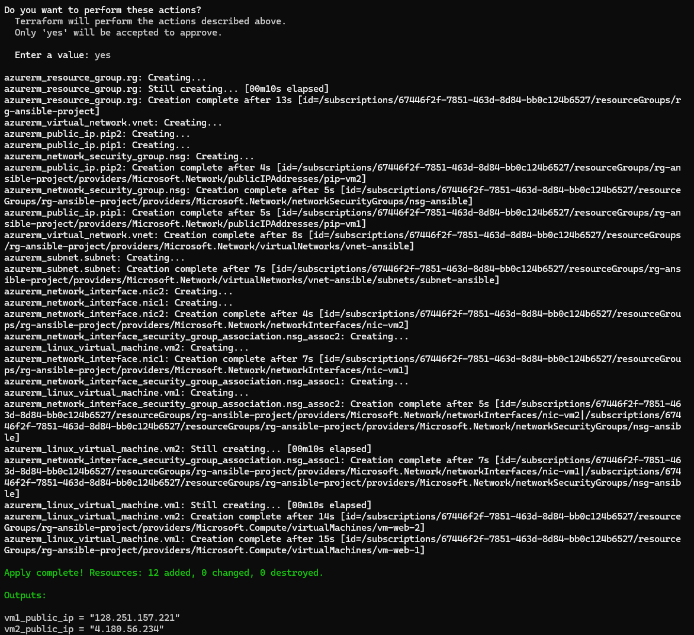
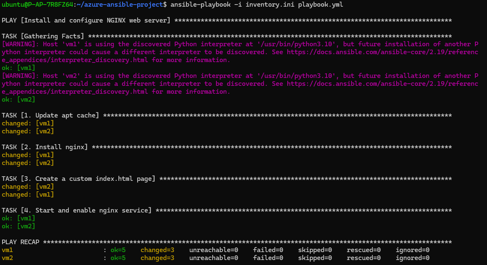
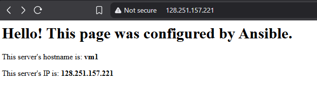

# Azure VM Fleet Provisioning with Terraform & Ansible

This project demonstrates a complete, end-to-end "Infrastructure as Code" and "Configuration Management" workflow. 

First, **Terraform** is used to provision a fleet of two identical Ubuntu VMs on Microsoft Azure, complete with all necessary networking (VNet, Subnet, NSG). 

Second, **Ansible** is used to automatically configure these "blank" servers into fully functional NGINX web servers, each serving a unique, templated webpage.

## Project Goal

1.  Provision a reproducible cloud infrastructure (2x VMs, 1x VNet) using **Terraform**.
2.  Write an **Ansible Playbook** to automate software configuration (installing NGINX).
3.  Use **Ansible Templates** (`.j2`) to deploy a dynamic `index.html` file to each server.
4.  Demonstrate a seamless workflow where Terraform creates the infrastructure and Ansible configures it.


## Architecture & Workflow

```mermaid
graph TD
    A(DevOps Engineer) -- 1. terraform apply --> B[Azure Cloud];
    B -- 2. Provisions --> C(2x Ubuntu VMs);
    B -- 3. Provisions --> D(VNet / NSG / IPs);
    
    A -- 4. ansible-playbook --> E(Ansible Control Node (Local WSL/Ubuntu));
    
    subgraph "Terraform Provisioning"
        B
        C
        D
    end

    subgraph "Ansible Configuration"
        E
    end

    E -- SSH --> C;
    C -- HTTP --> F(User);

```

**Workflow:**

1.  **Terraform (`main.tf`):** Defines a resource group, VNet, subnet, and a network security group (NSG) that allows SSH (port 22) and HTTP (port 80).
2.  **Terraform (VMs):** Provisions two `azurerm_linux_virtual_machine` resources (`vm-web-1`, `vm-web-2`) using a secure SSH key for authentication (`~/.ssh/id_rsa.pub`).
3.  **Terraform (`outputs.tf`):** Outputs the public IP addresses of both VMs.
4.  **Ansible (`inventory.ini`):** These IPs are manually added to an inventory file, which groups them as `[webservers]` and defines the `ansible_user` and `ansible_ssh_private_key_file`.
5.  **Ansible (`playbook.yml`):** A playbook is run that targets the `webservers` group. It uses `become: yes` to run tasks as root.
6.  **Ansible Tasks:**
    * **Task 1:** Uses the `ansible.builtin.apt` module to install NGINX.
    * **Task 2:** Uses the `ansible.builtin.template` module to copy a local `index.html.j2` template to `/var/www/html/index.html` on each server.
    * **Task 3:** The template uses Ansible variables (`{{ inventory_hostname }}`) to create a unique page for each server.
    * **Task 4:** Uses the `ansible.builtin.service` module to ensure NGINX is `started` and `enabled`.


## Project Screenshots

### 1. Terraform Apply (Infrastructure)

*Terraform successfully provisions the 2 VMs and outputs their public IP addresses.*

### 2. Ansible Playbook (Configuration)

*The `ansible-playbook` run, showing `ok=5, changed=3` for both `vm1` and `vm2`, confirming all tasks were successfully executed.*

### 3. Final Result (Web Server)

*Accessing the public IP of `vm1` in a browser, showing the custom `index.html` page that was deployed by the Ansible template.*


## How to Clean Up

To destroy all cloud resources and stop incurring costs, run the following command from the project's root folder:

```bash
terraform destroy